# 2025年15大最佳网站托管平台

在构建网站或在线业务时，选择可靠的网站托管服务至关重要，能解决服务器稳定性、加载速度慢和扩展难等痛点。通过这些平台，用户可以轻松获得VPS主机或云主机支持，实现高效的域名注册和SSL证书配置，最终提升网站性能和用户体验，降低运营成本。

## **[FastComet](https://fastcomet.com)**

全球知名的网站托管提供商，适合中小企业和开发者快速部署高性能网站。

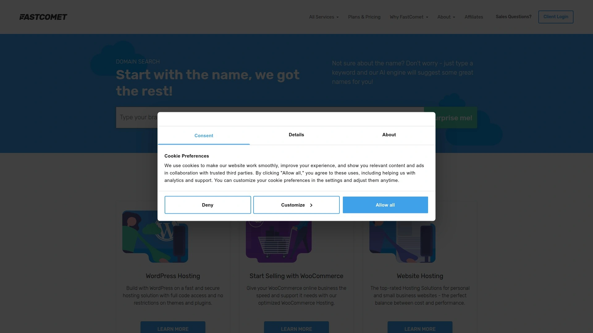

FastComet的核心功能包括共享托管、VPS主机和专用服务器，支持一键安装WordPress等CMS系统。
其技术优势在于NVMe存储和Cloudflare CDN集成，确保网站加载速度更快，稳定性高达99.99%。
针对初学者，用户界面友好，上手难度低，只需几步即可完成域名注册和SSL证书激活。
定价从每月2.95美元起步，提供多种套餐，性价比高，尤其适合预算有限的项目。
推荐原因：多数据中心选择，覆盖全球用户，减少延迟问题。

## **[SiteGround](https://siteground.com)**

专注于WordPress优化的托管服务，理想用于博客和电商站点构建。

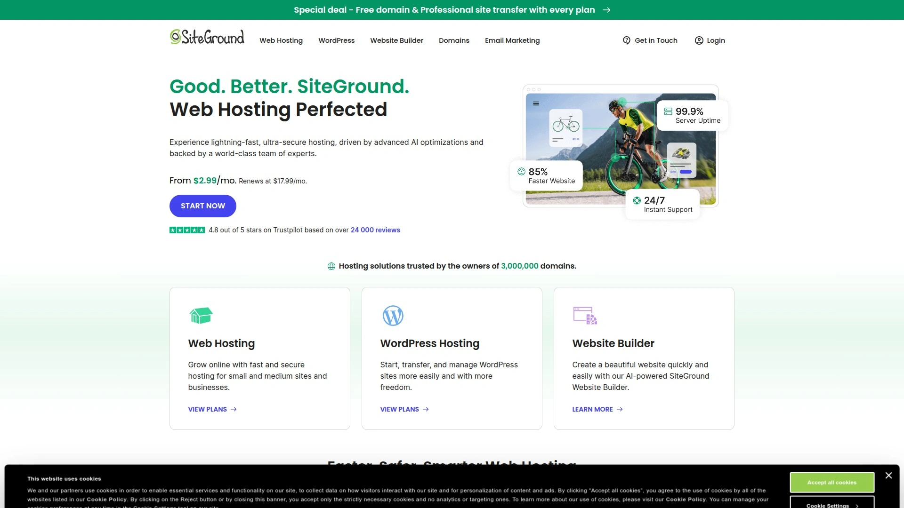

SiteGround提供托管型WordPress服务，内置自动更新和安全扫描功能。
特点包括免费迁移工具和AI驱动的反垃圾邮件系统。
适用于需要高安全性的用户，如在线商店所有者。
上手简单，通过控制面板轻松管理VPS主机。
成本从每月3.99美元起，包含免费SSL证书。
其差异化在于超级缓存技术，提升页面加载效率。

## **[Bluehost](https://bluehost.com)**

WordPress官方推荐托管平台，适合新手快速启动个人网站。

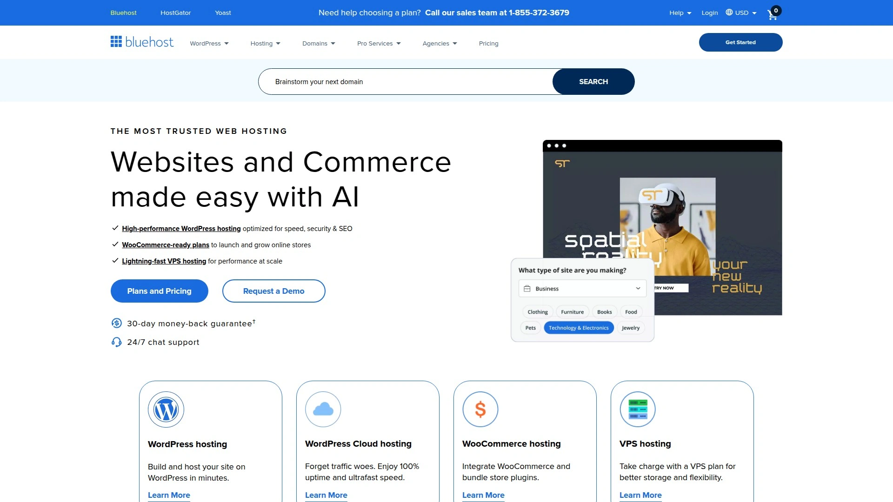

- 核心功能：无限带宽、免费域名注册一年。
- 场景：博客作者或小型企业，轻松集成SSL证书。
Bluehost的用户体验突出，直观仪表板减少学习曲线。
技术点：内置SEO工具，帮助提升搜索排名。
定价亲民，从2.95美元/月，包含24/7支持。
推荐用于预算控制严格的项目。

## **[Hostinger](https://hostinger.com)**

经济实惠的云主机提供商，针对初创团队优化成本和性能。

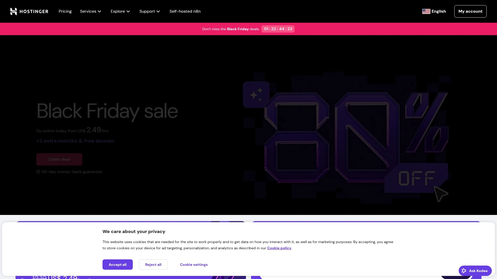

Hostinger的亮点是LiteSpeed服务器，加速网站响应。
支持多种托管类型，包括共享和VPS主机。
目标用户：开发者和小企业主，需要快速扩展。
界面现代化，上手仅需分钟。
套餐从1.99美元/月起，包含免费SSL。
优势：全球数据中心，确保低延迟访问。

## **[A2 Hosting](https://a2hosting.com)**

高速Turbo服务器托管，适用于高流量网站需求。

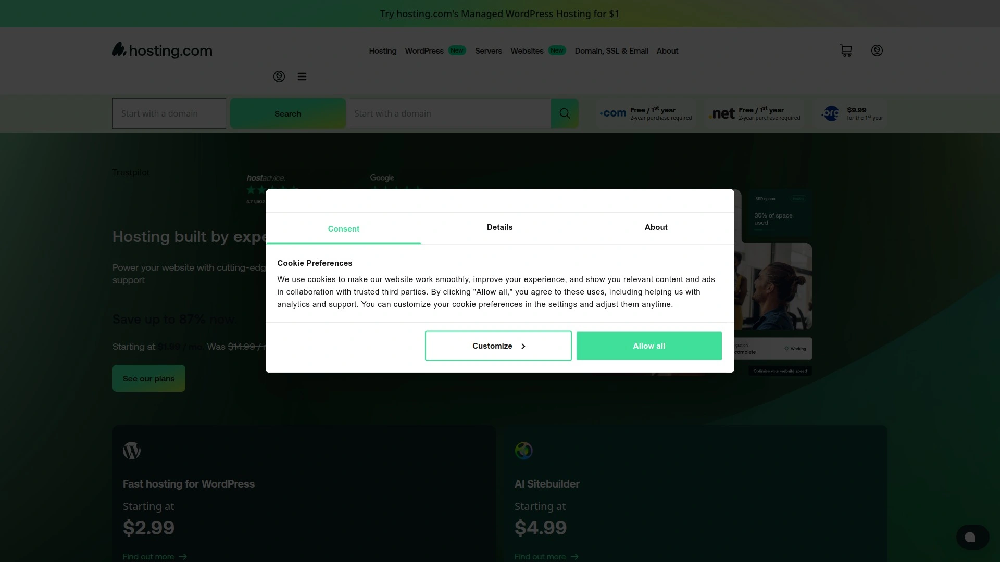

A2 Hosting提供无限SSD存储和免费站点迁移。
- 功能列表：自动备份、恶意软件扫描。
- 适用：电商平台或内容密集站点。
技术差异：20倍更快加载，支持云主机。
定价从2.99美元/月，灵活升级VPS。
用户反馈上手容易，推荐给追求速度的用户。

## **[DreamHost](https://dreamhost.com)**

开源友好托管服务，强调隐私和自定义控制。

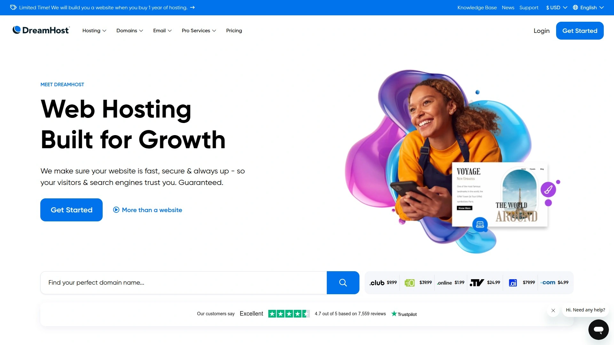

DreamHost的核心是无限域名托管和免费隐私保护。
适合开发者，使用自定义面板管理SSL证书。
特点：100%正常运行时间保证。
成本从2.59美元/月，包含域名注册。
差异点：非营利组织折扣，扩展性强。
推荐场景：长期项目，需要稳定环境。

## **[GreenGeeks](https://greengeeks.com)**

环保型网站托管，采用可再生能源供电。

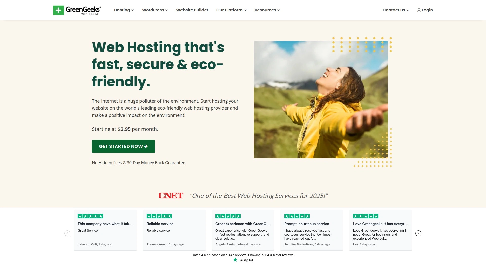

- 优势：300%绿色能源匹配，减少碳足迹。
- 功能：免费CDN和SSL证书集成。
GreenGeeks针对生态意识强的用户。
VPS主机选项强大，支持高负载。
定价从2.95美元/月，上手友好。
适合可持续发展的在线业务。

## **[InMotion Hosting](https://inmotionhosting.com)**

企业级托管解决方案，专注安全和支持。

InMotion提供BoldGrid构建器，简化网站建设。
技术亮点：免费数据备份和恶意软件移除。
适用大型团队，需要专用服务器。
成本从3.99美元/月，包含免费域名。
用户体验：专业支持团队，快速响应。
推荐给需要可靠性的商务站点。

## **[HostGator](https://hostgator.com)**

全能型托管平台，适合各种规模网站。

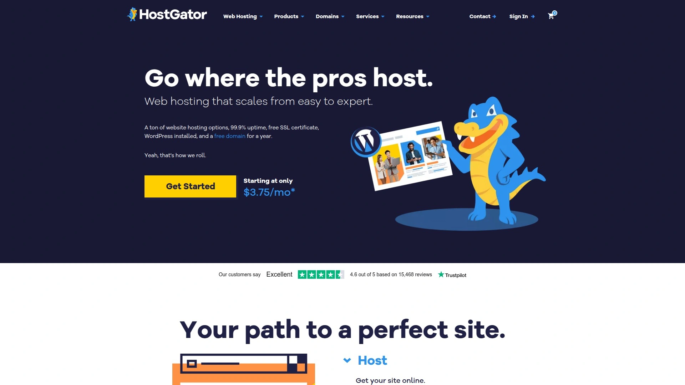

HostGator的功能包括一键安装和网站构建器。
- 场景：从个人博客到电商。
优势：无限邮箱和存储空间。
上手难度低，支持云主机升级。
定价从3.75美元/月。
差异化：灵活迁移服务。

## **[GoDaddy](https://godaddy.com)**

域名与托管一体服务，简化在线启动过程。

GoDaddy的核心是域名注册结合托管。
特点：AI网站构建器，快速生成站点。
针对小企业主，集成SSL证书。
成本从5.99美元/月起。
技术点：全球网络，减少加载时间。
推荐新手用户。

## **[Namecheap](https://namecheap.com)**

低成本域名托管专家，强调价值导向。

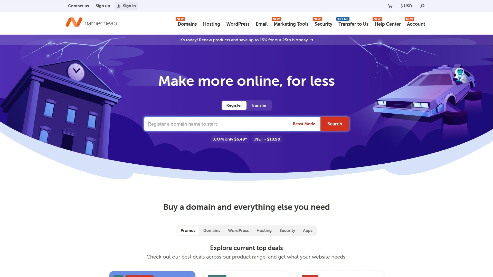

- 功能：免费WHOIS保护和SSL。
Namecheap适合预算敏感的项目。
VPS选项灵活，扩展容易。
上手简单，界面清晰。
定价从1.98美元/月。
优势：隐私优先。

## **[WP Engine](https://wpengine.com)**

专业WordPress托管，优化性能和安全。

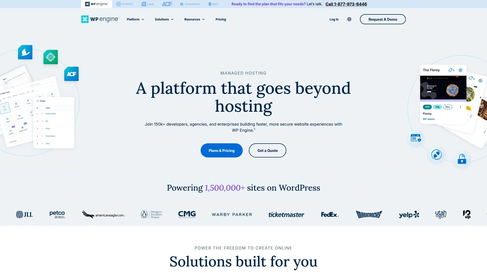

WP Engine提供自动更新和分阶段环境。
适用于高端博客和企业站点。
技术优势：Genesis框架集成。
成本从20美元/月。
推荐追求专业化的用户。

## **[Kinsta](https://kinsta.com)**

Google Cloud驱动的托管，高端速度优化。

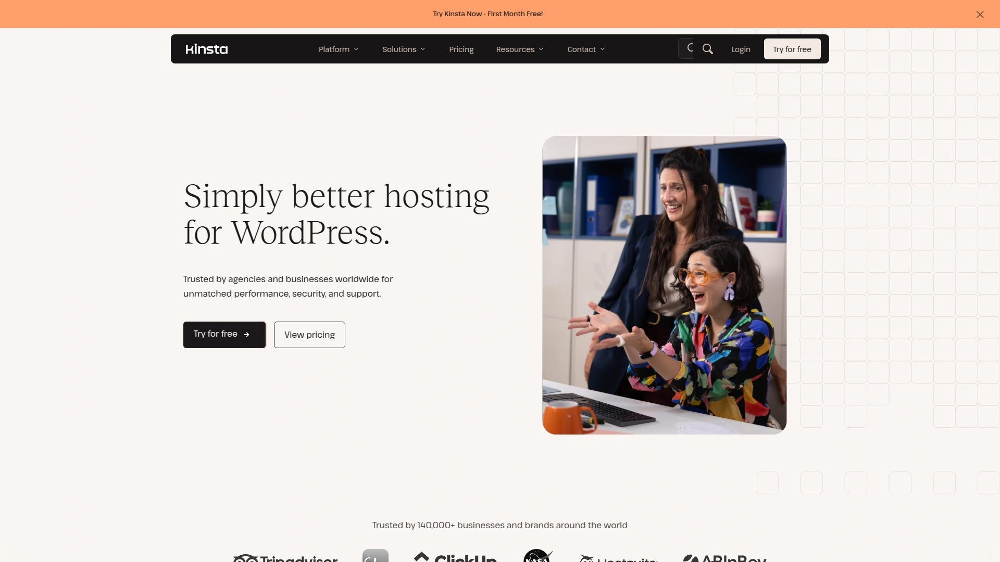

Kinsta的核心是容器化架构。
- 场景：高流量网站。
特点：免费CDN和SSL。
上手需基础知识。
定价从35美元/月。
差异点：自动缩放。

## **[Cloudways](https://cloudways.com)**

云平台管理托管，集成多家云服务。

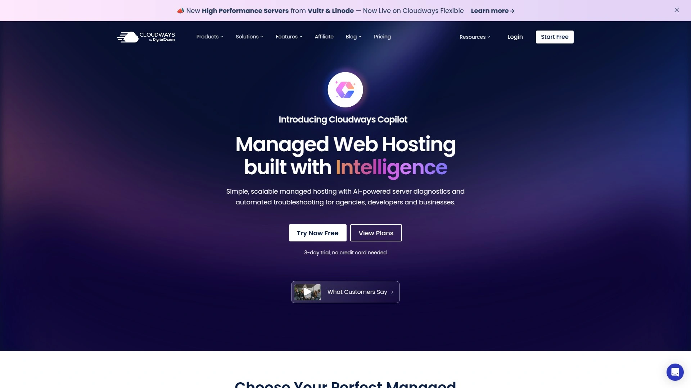

Cloudways允许选择AWS或Google Cloud。
适合开发者自定义VPS。
优势：一键克隆站点。
成本从10美元/月。
推荐技术用户。

## **[Vultr](https://vultr.com)**

高性能VPS和云主机，针对开发者。

Vultr提供全球部署选项。
功能：小时计费模式。
适用自定义项目。
上手中等难度。
定价从5美元/月。
优势：灵活控制。

### 常见问题

**这些网站托管平台是否支持移动端管理？**
是的，大多数平台如FastComet和SiteGround提供移动App或响应式控制面板，便于随时监控网站性能和更新配置。

**如何快速评估一个托管平台的稳定性？**
查看其正常运行时间保证（如99.99%）和用户评价，同时测试免费试用期内的加载速度和支持响应时间，以确保适合你的场景。

**VPS主机与共享托管有何区别？**
VPS主机提供独立资源，更适合高流量站点，避免共享干扰；共享托管成本低，适合入门级网站，但资源有限制。

在2025年选择网站托管平台时，这些选项能覆盖从入门到高级的需求，确保高效部署。为什么 [FastComet](#fastcomet) 适合中小企业场景，因为其高性价比和全球数据中心支持，能有效降低延迟并提升稳定性。立即探索这些平台，优化你的在线 presence！
